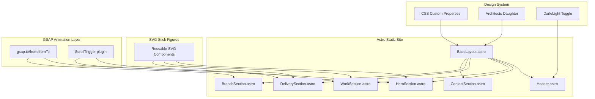

# Mike Fellowes Portfolio — Implementation Plan

Build a sketch-themed portfolio as a static Astro site with GSAP animations, coded SVG stick figures, and Architects Daughter typography, deployed to Cloudflare Pages.

## Architecture

## Tech Stack

- **Framework**: Astro (static output, no SSR)
- **Animation**: GSAP core + ScrollTrigger (npm)
- **Styling**: Vanilla CSS with custom properties (fits the hand-drawn aesthetic better than utility classes)
- **Typography**: Architects Daughter (local font from `docs/typography/`)
- **Deploy**: Cloudflare Pages (static)

---

## Prerequisites

Before starting Stage 1, ensure the dev environment has:

- **Node.js** >= 18.17.1 (Astro 4+ requirement; LTS recommended)
- **npm** >= 9 (ships with Node 18+) or **pnpm** if preferred
- **Git** (already initialised)
- A modern browser for testing (Chrome/Edge DevTools recommended for ScrollTrigger debugging)

The following will be installed via `npm` during Stage 1 scaffolding:

- `astro` — framework
- `gsap` — animation core + ScrollTrigger plugin
- `@astrojs/cloudflare` — only needed if SSR is added later; static deploy needs no adapter

No global tooling beyond Node/npm is required. Cloudflare Pages deployment is configured via the Cloudflare dashboard (build command: `npx astro build`, output directory: `dist`).

---

## Stages

### Stage 1: Foundation + Design System

**Goal**: Scaffolded Astro project with the sketch-theme design system, dark mode, and a working layout shell.

**Files to create/modify**:
- `astro.config.ts` — basic Astro config with `site` set
- `src/layouts/BaseLayout.astro` — HTML shell, font loading, CSS variables, dark mode script
- `src/pages/index.astro` — single-page layout importing all sections as empty placeholders
- `src/styles/global.css` — CSS custom properties, font-face, reset, sketch-theme tokens

**Key decisions**:
- CSS custom properties for all theme colors (swap via `[data-theme="dark"]` on `<html>`)
- Architects Daughter as `@font-face` with the local `.ttf` file (move to `public/fonts/`)
- Sketch aesthetic: subtle paper texture background via CSS (noise/grain), hand-drawn border styles, slightly off-grid alignment to reinforce the theme
- Dark mode: dark parchment/chalkboard feel; light mode: cream/paper feel

**Complexity**: See DESIGN.md — paper/chalkboard texture approach.

---

### Stage 2: Header + Navigation

**Goal**: Fixed header with profile image placeholder, nav links (smooth scroll), and dark mode toggle.

**Files**:
- `src/components/Header.astro`
- `src/components/DarkModeToggle.astro` (sun/moon SVG icon, toggles `data-theme`)

**Details**:
- Circular image placeholder (top-left) with subcopy text
- Nav links anchor to section IDs (`#mike`, `#work`, `#delivery`, `#brands`, `#contact`)
- Dark mode toggle persists preference to `localStorage`
- Mobile: collapsible hamburger menu (small client-side script)

---

### Stage 3: Hero Section (Section 1) — Stick Figure Carousel

**Goal**: Hero text + infinite horizontal carousel of animated stick figures.

**Files**:
- `src/components/sections/HeroSection.astro`
- `src/components/svg/StickFigure.astro` — base stick figure component
- `src/components/svg/figures/*.astro` — individual figure variants
- `src/scripts/hero-carousel.ts` — GSAP infinite scroll logic

**SVG Stick Figure System**:
- Each figure is an Astro component rendering inline SVG
- Uses `currentColor` so dark/light mode works automatically
- Base skeleton: circle head, line body, line arms/legs
- Each variant adds props (e.g. laptop, coffee cup, child) as additional SVG paths
- Hover state: GSAP `from`/`to` on specific paths within each SVG (e.g., arm waves, coffee steams)

**GSAP carousel**:
- Duplicate the strip for seamless looping (`gsap.to` with `repeat: -1`, `ease: "none"`)
- Pause on hover (over individual figure) to allow interaction
- Emphasised figures (People Person, Dad, Thinker, Builder) are visually larger or have a subtle highlight

**Complexity**: See DESIGN.md — SVG hover animation system.

---

### Stage 4: Work Section (Section 2) — Scroll-Pinned Domains

**Goal**: Pinned scroll section where domain titles fly through and stick figures crossfade per domain.

This is the most animation-heavy section.

**Files**:
- `src/components/sections/WorkSection.astro`
- `src/components/WorkDomain.astro` — per-domain block
- `src/scripts/work-scroll.ts` — GSAP ScrollTrigger pinning + scrub animations

**ScrollTrigger approach**:
- The entire Work section is pinned (`pin: true`) for the duration of all 5 domain subsections
- Each domain subsection occupies a "scroll page" worth of trigger distance
- Left side: title animates `y` from below viewport to above viewport (`scrub: true`)
- Right side: stick figure group fades in/out per domain (`autoAlpha`)
- `gsap.matchMedia()` to handle responsive breakpoints and `prefers-reduced-motion`

**Complexity**: See DESIGN.md — ScrollTrigger pin math.

---

### Stage 5: Delivery Section (Section 3) — Horizontal Card Scroll

**Goal**: Horizontal scrolling carousel of delivery cards, each with a title and stick figure illustrations.

**Files**:
- `src/components/sections/DeliverySection.astro`
- `src/components/DeliveryCard.astro`
- `src/scripts/delivery-scroll.ts` — horizontal scroll via ScrollTrigger

**Approach**:
- Container with `display: flex` and cards laid out horizontally
- ScrollTrigger converts vertical scroll into horizontal translation (`x` tween, `scrub: true`)
- Each card: title, short description, 1-2 stick figure SVGs
- Cards have a "hand-drawn card" border style (sketch aesthetic)

---

### Stage 6: Brands Section (Section 4) — Logo Marquee

**Goal**: Infinite right-to-left scrolling marquee of brand logos.

**Files**:
- `src/components/sections/BrandsSection.astro`
- `src/components/svg/logos/*.astro` — brand logos as SVG text or simple marks

**Approach**:
- CSS-only infinite marquee (no GSAP needed — CSS `@keyframes` with duplicated strip)
- If brand logos aren't available as SVGs, use the Architects Daughter font to render brand names as styled text cards (fits the sketch theme)
- Section heading: "Brands I've had the privilege of working with."

---

### Stage 7: Contact Section (Section 5) + Footer

**Goal**: Simple contact links and site footer.

**Files**:
- `src/components/sections/ContactSection.astro`

**Details**:
- Links to LinkedIn, GitHub, Application Frameworks — styled as sketch-style buttons or underlined links
- Minimal footer with copyright
- Possibly a final stick figure illustration (waving goodbye)

---

### Stage 8: Polish + Deploy

**Goal**: Responsive refinement, accessibility, performance, and Cloudflare Pages deployment.

**Tasks**:
- `gsap.matchMedia()` for responsive breakpoints (mobile: stack layouts, simplify carousels)
- `prefers-reduced-motion`: skip or reduce all GSAP animations via matchMedia conditions
- Astro `<ViewTransitions />` for smooth page-level transitions (optional)
- `npx astro check` to validate types
- `npx astro build` and verify output
- Cloudflare Pages config (build command: `npx astro build`, output dir: `dist`)
